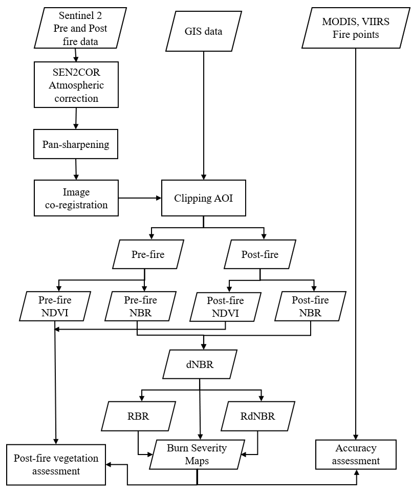
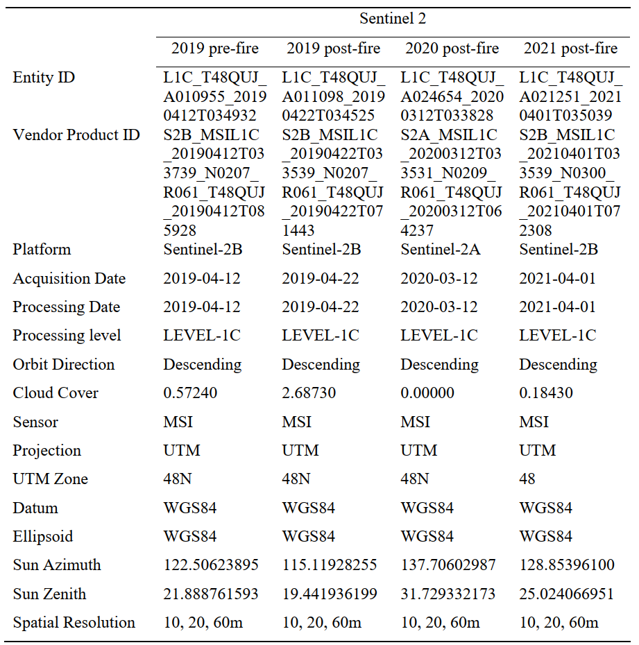
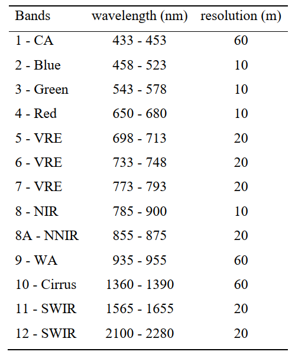
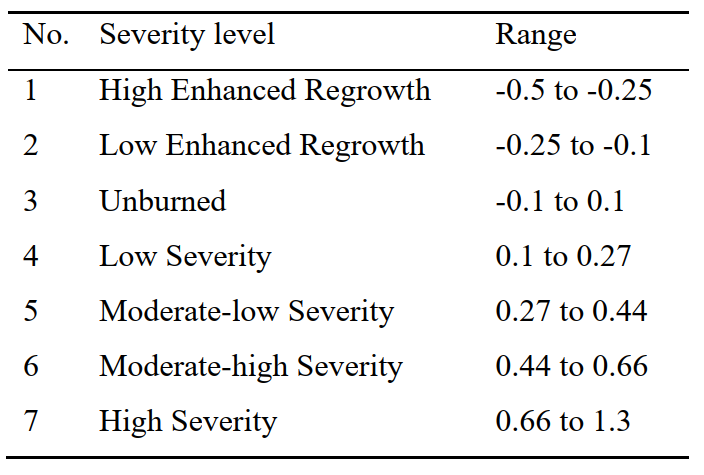
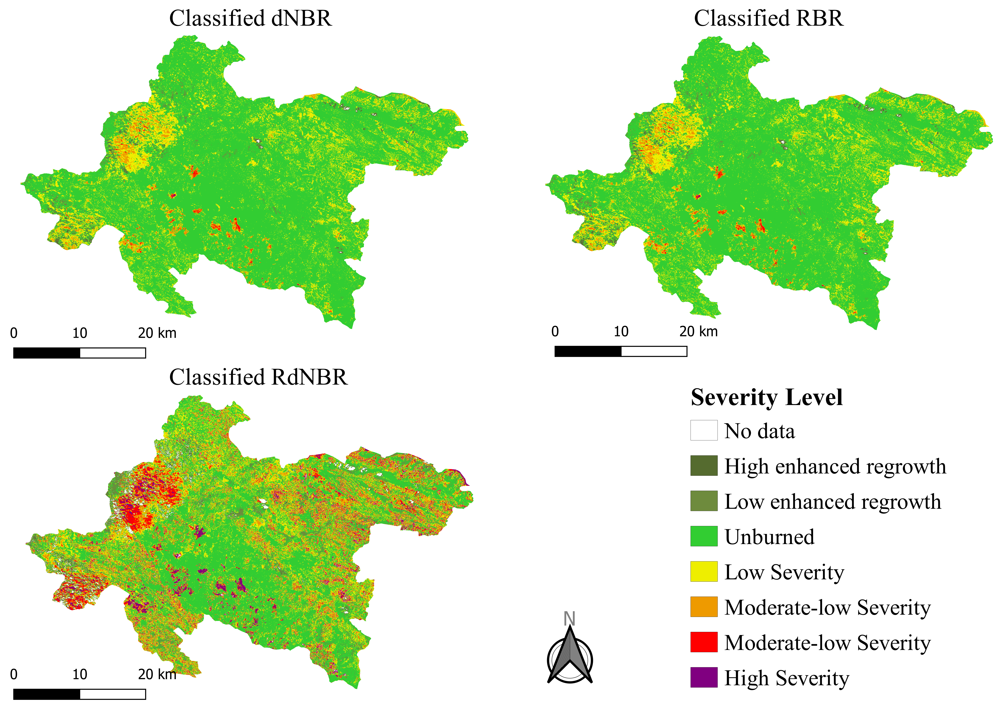
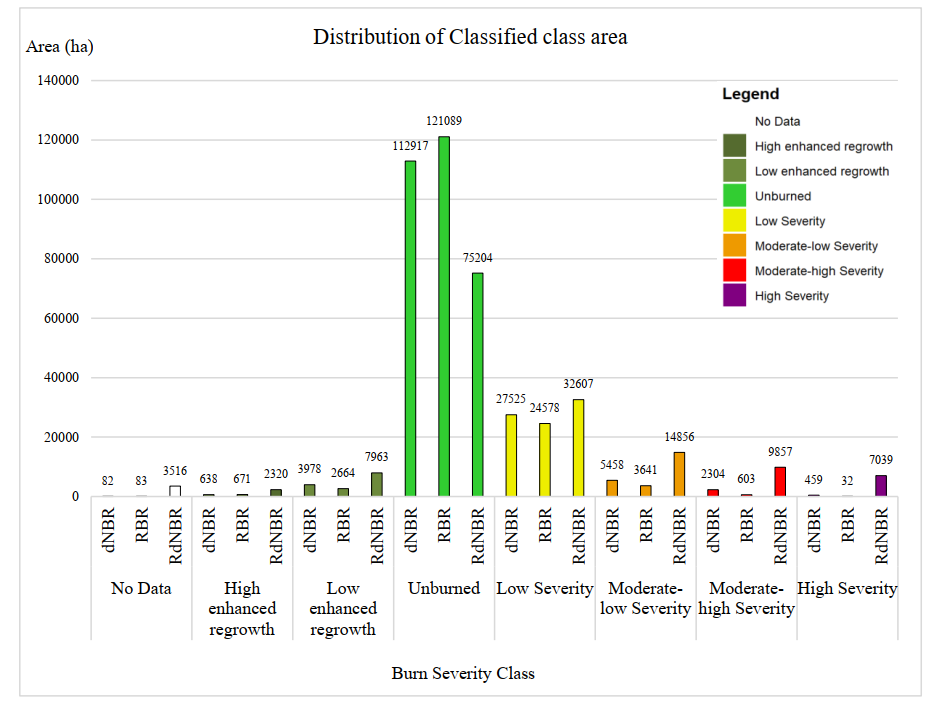
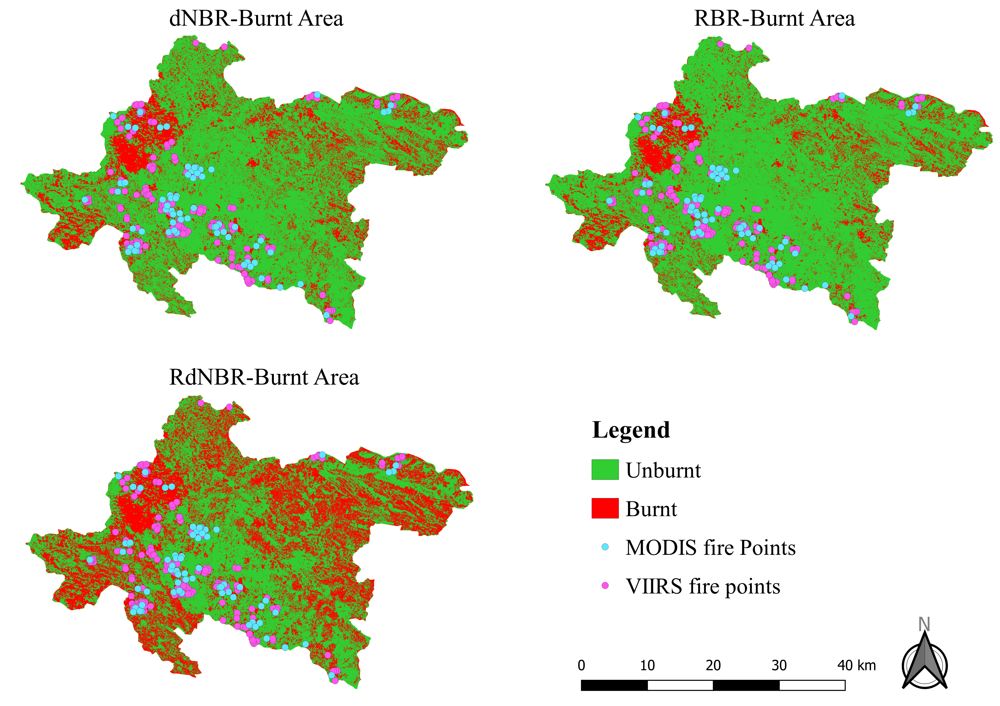
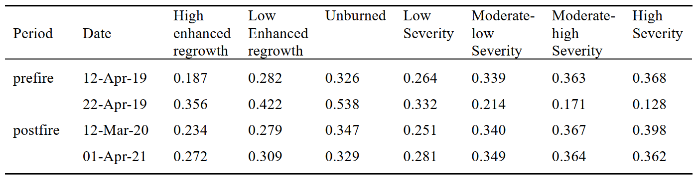
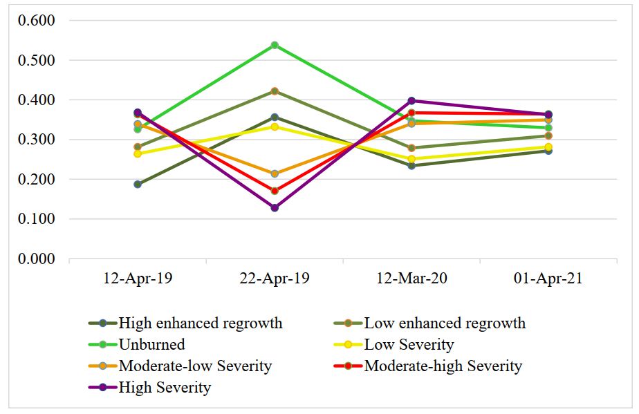

> 🛈 Information: This project was hosted at [GitHub](https://github.com/VietDucNg/burnSeverity_and_post-fireAssessment).

\

# 1. Introduction

In April 2019, from 16th to 21st in Thuan Chau district, Son La province, Vietnam, there was a forest fire causing significant damage. However, very little work has been conducted examining burn severity and monitoring post-fire vegetation regrowth.

In this context, the aims of the study are to assess forest fire severity and vegetation regeneration in the Thuan Chau district from April 2019 to April 2021, as well as compare different reflectance indices for burnt severity mapping. The most widely used fire severity indices, such as the differenced normalized burn ratio (dNBR), relativized burn ratio (RBR), and relativized dNBR (RdNBR), are calculated and evaluated based on their accuracy regarding active fire sites reported by MODIS and VIIRS.

Besides, NDVI was used for assessing the post-fire vegetation regrowth, also the relationship between vegetation regeneration to burn severity is taken into consideration.

## 1.1 Objectives

In this study, some specific tasks are performed:

1.  Acquiring, investigating, pre-processing Sentinel-2 image of pre-and post-fire\
2.  Acquiring MODIS and VIIRS data of active fire points\
3.  Calculation of NDVI, NBR, dNBR, RBR and RdNBR indices\
4.  Mapping burn severity based on dNBR, RBR and RdNBR\
5.  Accuracy assessment of burn severity map based on active fire points\
6.  Post-fire vegetation assessment based on NDVI.

\

# 2. The study area

This research considers the forest fire area of Thuan Chau district, Son La province, Viet Nam, as the study area.


```{r eval=FALSE}
# load nescessary library for the project
library(raster)
library(sp)
library(rgdal)
library(ggplot2)
library(readxl)
library(raster)
library(reshape2)
library(RStoolbox)

```

```{r include=FALSE}
# run but not display
library(raster)
library(sp)
library(ggplot2)
library(readxl)
library(raster)
library(reshape2)
```

```{r eval=FALSE}
#### Clip Sentinel images to AOI ####

### untar multiple sentiel image files
setwd("e:/exam")
# Set path for downloads folder
path <- "e:/exam/data/download"
# Retrieve list of .tar.gz files in downloads folder
filenames <- list.files(path, pattern = ".zip", full.names = TRUE)
# Create folder names for each dataset without extension
foldername <- sub("\\..*$", "", basename(filenames))
# loop through each dataset and untar to new folders
for (i in filenames) {
  foldername <- sub("\\..*$", "", basename(i))
  dir.create(foldername)
  file <- file.path(wd, foldername)
  untar(i, exdir = file)
}

### pre-file image
setwd("e:/exam/data/download/S2B_MSIL2A_20190412T033739_N0211_R061_T48QUJ_20190412T093531_resampled.data")
b2_pre <- raster("B2.img")
b3_pre <- raster("B3.img")
b4_pre <- raster("B4.img")
b8_pre <- raster("B8.img")
b12_pre <- raster("b12.img")

# clip to AOI area
aoi <- readOGR("data/vector/AOI_area.shp")
aoi <- spTransform(aoi, CRS(proj4string(b2_pre)))

clip_b2_pre <- crop(b2_pre,aoi)
clip_b3_pre <- crop(b3_pre,aoi)
clip_b4_pre <- crop(b4_pre,aoi)
clip_b8_pre <- crop(b8_pre,aoi)
clip_b12_pre <- crop(b12_pre,aoi)

setwd("e:/exam/data/download/S2B_MSIL2A_20190412T033739_N0211_R061_T48QUJ_20190412T093531_resampled.data/clip")
writeRaster(clip_b2_pre,"clip_B2_pre.tif", overwrite = TRUE)
writeRaster(clip_b3_pre,"clip_B3_pre.tif", overwrite = TRUE)
writeRaster(clip_b4_pre,"clip_B4_pre.tif", overwrite = TRUE)
writeRaster(clip_b8_pre,"clip_B8_pre.tif", overwrite = TRUE)
writeRaster(clip_b12_pre,"clip_B12_pre.tif", overwrite = TRUE)

# stack to singel raster
setwd("e:/exam/data/download/S2B_MSIL2A_20190412T033739_N0211_R061_T48QUJ_20190412T093531_resampled.data/clip")
clip_stack_pre <- stack(clip_b2_pre,clip_b3_pre,clip_b4_pre,
                        clip_b8_pre,clip_b12_pre)
writeRaster(clip_stack_pre,"clip_stack_pre.tif", overwrite = TRUE)

```

... similar code for post-fire image 1,2, and 3.

\

# 3. Material and method



## 3.1. Data preparation

There are 04 Sentinel-2 images of the Thuan Chau district were collected (Table 1). Images with low cloud cover (\<3%), as close as possible to the start and end date of the fire were obtained.

Seasonal changes in both spectral radiation (e.g. Sun elevation angle, Sun-Earth distance, meteorological circumstances) and surface reflection were minimized by selecting images around the same dates in different years. In particular, a pre-fire image acquired on 12th April 2019, while 03 post-fire images were obtained on 22nd April 2019, 12th March 2020, and 1st April 2021.


**Table 1.** Metada of images used in this study



The 4 acquired Sentinel images are processed at level L1C top-of-atmosphere (TOA) reflectance data which includes radiometric and geometric corrections along with orthorectification to generate highly accurate geolocated products (USGS EROS Archive - Sentinel-2, 02-Dec-21). Table 1 and Table 2 provide metadata and detailed parameters of the spectral bands of the used satellite images.

**Table 2.** Basic characteristics of Sentinel-2 image



The atmospheric correction process aims to remove the effects of the atmosphere influencing the signal measured by a satellite sensor (Hoepffner & Zibordi, 2009). The 04 images were atmospherically corrected using the Sen2Cor version 2.9 which is a processor for generating level 2A products from TOA reflectance Level-1C input image. The processor performs the atmospheric-, terrain and cirrus correction (Sen2Cor -- STEP, 02-Dec-21).

Image co-registration is performed when studying time-series analysis, basically to understand change during the period of time. The goal of co-registration is to align the pictures spatially so that each feature in one image overlaps exactly with its footprint in any other image in the time series. In this study, the 03 post-fire images were co-registered based on the pre-fire image as the reference image, using package RStoolbox in the R.

```{r eval=FALSE}
#### image co-registration ####
regis_clip_stack_post1 <- coregisterImages(clip_stack_post1, 
                                           master = clip_stack_pre,
                                           nSamples = 500, reportStats = TRUE)

regis_clip_stack_post1 <- alignExtent(clip_stack_pre,clip_stack_post1)

# write raster
writeRaster(regis_clip_stack_post1,"data/download/S2B_MSIL2A_20190422T033539_N0211_R061_T48QUJ_20190422T074708_resampled.data/clip/regis_clip_stack_post1.tif", overwrite = TRUE)

```

As no fire occurrence data was available, for accuracy assessment of the burn severity map, the study used the active fire points acquired by Moderate Resolution Imaging Spectroradiometer (MODIS) Terra satellite (MOD14_NRT) and SUOMI NPP Visible Infrared Imaging Radiometer Suite (VIIRS) (VNP14IMGTDL_NRT) products data were downloaded from FIRMS NASA website (<https://firms.modaps.eosdis.nasa.gov>) (Fig. 1).

## 3.2. Candidate fire severity indices

The following candidate fire severity indices were generated for each pair of pre- and post-fire images: differenced normalised burn ratio (dNBR), Relativized Burn Ratio (RBR), and relativised dNBR (RdNBR).

Normalized Burn Ratio (NBR) was calculated using the following equation (Eq. 1) for both pre-fire and post-fire. The NBR value ranges from -1 to +1 with maximum values for vegetation and minimum values for burnt areas.

**Equation 1.** NBR calculation 
$$
NBR = \frac{NIR - SWIR}{NIR+SWIR}
$$


```{r eval=FALSE}
#### NBR calculation ####
### pre-fire image ###
nbr_pre <- (clip_b8_pre - clip_b12_pre)/(clip_b8_pre + clip_b12_pre)

# clip to AOI
aoi <- readOGR("data/vector/AOI_ThuanChau.shp")
aoi <- spTransform(aoi, CRS(proj4string(nbr_pre)))
nbr_pre <- mask(nbr_pre, aoi)
nbr_pre <- crop(nbr_pre,aoi) 

### post-fire image 1
nbr_post <- (clip_b8_post1 - clip_b12_post1)/(clip_b8_post1 + clip_b12_post1)

# clip to AOI
nbr_post <- mask(nbr_post, aoi)
nbr_post <- crop(nbr_post,aoi) 
```

```{r include=FALSE}
nbr_pre = raster('output/04_nbr/nbr_pre.tif')
nbr_post = raster('output/04_nbr/nbr_post.tif')
# aoi = sf::read_sf("data/vector/AOI_ThuanChau.shp")
# aoi = st_transform(aoi, CRS(proj4string(nbr_post)))

```

```{r}
# print results
nbr_pre
nbr_post

# plot
par(mfrow = c(1,2))
plot(nbr_pre, main = 'prefire')
plot(nbr_post, main = 'postfire')
title('Normalized Burn Ratio (NBR)',line = -1, outer = TRUE)
```


The dNBR (Eq. 2) was calculated from pre-fire NBR and post-fire NBR. The higher dNBR values refer to higher burn severity.

**Equation 2.** dNBR calculation 

$$
dNBR = NBR\_{prefire} - NBR\_{postfire}
$$


```{r}
#### dNBR calculation ####
dnbr = nbr_pre - nbr_post
dnbr
plot(dnbr, main='differenced normalised burn ratio (dNBR)')
```


RBR (Eq. 3) was derived based on the ratio of dNBR and adjusted pre-fire NBR. The denominator was added a value of 1.001 to make sure that it will not tend to zero (Parks et al., 2014).

**Equation 3.** RBR calculation
$$
RBR = \frac{dNBR}{NBR_{prefire} + 1.001}
$$

```{r}
#### RBR calculation ####
rbr = dnbr/(nbr_pre + 1.001)
rbr
plot(rbr, main='Relativized Burn Ratio (RBR)')
```

The RdNBR was a distinct dNBR variant that takes into account the relative amount of pre-fire shift by dividing dNBR with the pre-fire NBR value (Konkathi & Shetty, 2021). RdNBR was derived using Eq. 4.


**Equation 4.** RdNBR calculation

$$
RdNBR = \frac{dNBR}{\sqrt{|NBR_{prefire}|}}
$$


```{r}
#### RdNBR calculation ####
rdnbr = dnbr/sqrt(abs(nbr_pre))
rdnbr
plot(rdnbr, main = 'The Relativized differenced Normalized Burn ratio (RdNBR)')
```

## 3.3. Burn severity map

The burn severity analysis was used to map the regions based on how much damage they sustained from the fire. The burn severity map was executed by segregating three indices of dNBR, RBR and RdNBR into different fire severity levels proposed by the United States Geological Survey (USGS, 2004) (Table 3).

**Table 3.** Threshold classifying burn severity



```{r}
#### Burn severity map ####

### dNBR ###
# set ranges for the Burn Severity classes
dNBR_ranges <- c(-Inf,-.5,0, # out of range - no data
                 -.5,-.25,1, #enhanced regrowth, high
                 -.25,-.1,2,     # enhanced regrowth, low
                 -.1,0.1, 3,    # unburned area
                 0.1, 0.27, 4,  # low severity
                 0.27, 0.44, 5, # moderate-low severity
                 0.44, 0.66, 6, # moderate-high severity
                 0.66, 1.4, 7,  # high severity
                 1.4, +Inf, 0)  # out of range - no data

# set classification matrix
class.matrix <- matrix(dNBR_ranges, ncol = 3, byrow = T)

# use matrix to reclassify dNBR_scaled
dNBR_reclass <- reclassify(dnbr, class.matrix, right=NA)

# view frequencies of reclassification values
freq(dNBR_reclass)

# build the attribute table for the legend 
dNBR_reclass <- ratify(dNBR_reclass) 
rat <- levels(dNBR_reclass)[[1]]

# create the text that will be on the legend
rat$legend  <- c("No Data",
                 "High enhanced regrowth",
                 "Low enhanced regrowth",
                 "Unburned",
                 "Low Severity",
                 "Moderate-low Severity",
                 "Moderate-high Severity",
                 "High Severity") 
levels(dNBR_reclass) <- rat 

# colour setting for the severity map
#my_col=c("#FFFFFF","#556b2f","#6e8b3d","#32CD32", "#EEEE00","#ee9a00", "#FF0000", "#800080")
my_col=c("white", "darkolivegreen","darkolivegreen4","limegreen", "yellow2", "orange2", "red", "purple")

# plots the burn severity map with title
plot(dNBR_reclass,
     legend=F,box=F,axes=F,
     col=my_col,
     cex.main=0.9,
     main="Sentinel-2 derived Burn Severity Map based on dNBR") 

# plot the legend on the right side of the burn severity map
legend(x='topright', legend =rat$legend,
       fill = my_col, y='topright',bty='n',
       inset=c(-0.15,0), xpd=T) 
```

```{r}
## Estimate fire affected area size
# get frequencies of the burn sverity classes
label  <- cbind(c("No Data",
                 "High enhanced regrowth",
                 "Low enhanced regrowth",
                 "Unburned",
                 "Low Severity",
                 "Moderate-low Severity",
                 "Moderate-high Severity",
                 "High Severity"))

# convert frequencies matrix to data frame
df <- NA
df <- cbind.data.frame(label,(freq(dNBR_reclass)[1:8,]))
# adjust the column name
colnames(df)[3] <- "pixelcount"
# calculate and add the percentage from the pixelcounts
df$pixelperc <- round((100*df$pixelcount)/sum(df$pixelcount),1)
# calculate the hectares from the pixelcounts
# sentinel pixel size is 20m X 20m --> the area is 400sqm = 0.04 hectares
df$area_ha <- round(((df$pixelcount*(xres(dNBR_reclass)^2))/10000),0)
df
```

```{r}
# Create a barplot for dNBR-based burn map class
ggplot(data = df, aes(x=label, y=area_ha))+
        geom_bar(stat = "identity", width = 0.5, color = "black", fill=my_col)+
        geom_text(aes(label=paste0(c(area_ha),'ha','\n[',c(pixelperc),'%]')),
                  vjust=-0.3, size=3.5)+
        scale_x_discrete(limits=c("No Data", "High enhanced regrowth", 
                                  "Low enhanced regrowth","Unburned",
                                  "Low Severity", "Moderate-low Severity",
                                  "Moderate-high Severity", "High Severity"))+
        labs(title="dNBR", x="Burn Severity class", y="Area (ha)")+
        theme_bw()+
        theme(plot.title = element_text(hjust = 0.5))
```

```{r}
### RBR ###
# set ranges for the Burn Severity classes
rbr_ranges <- c(-Inf,-.5,0, # out of range - no data
                -.5,-.25,1, #enhanced regrowth, high
                -.25,-.1,2,     # enhanced regrowth, low
                -.1,0.1, 3,    # unburned area
                0.1, 0.27, 4,  # low severity
                0.27, 0.44, 5, # moderate-low severity
                0.44, 0.66, 6, # moderate-high severity
                0.66, 1.4, 7,  # high severity
                1.4, +Inf, 0)  # out of range - no data

# set classification matrix
class.matrix <- matrix(rbr_ranges, ncol = 3, byrow = T)

# use matrix to reclassify RBR_scaled
rbr_reclass <- reclassify(rbr, class.matrix, right=NA)

# view frequencies of reclassification values
freq(rbr_reclass)

# build the attribute table for the legend 
rbr_reclass <- ratify(rbr_reclass) 
rat <- levels(rbr_reclass)[[1]]

# create the text that will be on the legend
rat$legend  <- c("No Data",
                 "High enhanced regrowth",
                 "Low enhanced regrowth",
                 "Unburned",
                 "Low Severity",
                 "Moderate-low Severity",
                 "Moderate-high Severity",
                 "High Severity") 
levels(rbr_reclass) <- rat 

# colour setting for the severity map
#my_col=c("#FFFFFF","#556b2f","#6e8b3d","#32CD32", "#EEEE00","#ee9a00", "#FF0000", "#800080")
my_col=c("white", "darkolivegreen","darkolivegreen4","limegreen", "yellow2", "orange2", "red", "purple")

# plots the burn severity map with title
plot(rbr_reclass,
     legend=F,box=F,axes=F,
     col=my_col,
     cex.main=0.9,
     main="Sentinel-2 derived Burn Severity based on RBR") 

# plot the legend on the right side of the burn severity map
legend(x='topright', legend =rat$legend,
       fill = my_col, y='topright',bty='n',
       inset=c(-0.15,0), xpd=T) 
```

```{r}
##Estimate fire affected area size
# get frequencies of the burn sverity classes
label  <- cbind(c("No Data",
                  "High enhanced regrowth",
                  "Low enhanced regrowth",
                  "Unburned",
                  "Low Severity",
                  "Moderate-low Severity",
                  "Moderate-high Severity",
                  "High Severity"))

# convert frequencies matrix to data frame
df <- cbind.data.frame(label,(freq(rbr_reclass)[1:8,]))
# adjust the column name
colnames(df)[3] <- "pixelcount"
# calculate and add the percentage from the pixelcounts
df$pixelperc <- round((100*df$pixelcount)/sum(df$pixelcount),1)
# calculate the hectares from the pixelcounts
# sentinel pixel size is 20m X 20m --> the area is 400sqm = 0.04 hectares
df$area_ha <- round(((df$pixelcount*(xres(rbr_reclass)^2))/10000),0)
df
```

```{r}
# Create a barplot for RBR-based burn map class
ggplot(data = df, aes(x=label, y=area_ha))+
        geom_bar(stat = "identity", width = 0.5, color = "black", fill=my_col)+
        geom_text(aes(label=paste0(c(area_ha),'ha','\n[',c(pixelperc),'%]')),
                  vjust=-0.3, size=3.5)+
        scale_x_discrete(limits=c("No Data", "High enhanced regrowth", 
                                  "Low enhanced regrowth","Unburned",
                                  "Low Severity", "Moderate-low Severity",
                                  "Moderate-high Severity", "High Severity"))+
        labs(title="RBR", x="Burn Severity class", y="Area (ha)")+
        theme_bw()+
        theme(plot.title = element_text(hjust = 0.5))
```

```{r}
### RdNBR ###
# set ranges for the Burn Severity classes
rdnbr_ranges <- c(-Inf,-.5,0, # out of range - no data
                -.5,-.25,1, #enhanced regrowth, high
                -.25,-.1,2,     # enhanced regrowth, low
                -.1,0.1, 3,    # unburned area
                0.1, 0.27, 4,  # low severity
                0.27, 0.44, 5, # moderate-low severity
                0.44, 0.66, 6, # moderate-high severity
                0.66, 1.4, 7,  # high severity
                1.4, +Inf, 0)  # out of range - no data

# set classification matrix
class.matrix <- matrix(rdnbr_ranges, ncol = 3, byrow = T)

# use matrix to reclassify RBR_scaled
rdnbr_reclass <- reclassify(rdnbr, class.matrix, right=NA)

# view frequencies of reclassification values
freq(rdnbr_reclass)

# build the attribute table for the legend 
rdnbr_reclass <- ratify(rdnbr_reclass) 
rat <- levels(rdnbr_reclass)[[1]]

# create the text that will be on the legend
rat$legend  <- c("No Data",
                 "High enhanced regrowth",
                 "Low enhanced regrowth",
                 "Unburned",
                 "Low Severity",
                 "Moderate-low Severity",
                 "Moderate-high Severity",
                 "High Severity") 
levels(rdnbr_reclass) <- rat 

# colour setting for the severity map
#my_col=c("#FFFFFF","#556b2f","#6e8b3d","#32CD32", "#EEEE00","#ee9a00", "#FF0000", "#800080")
my_col=c("white", "darkolivegreen","darkolivegreen4","limegreen", "yellow2", "orange2", "red", "purple")

# plots the burn severity map with title
plot(rdnbr_reclass,
     legend=F,box=F,axes=F,
     col=my_col,
     cex.main=0.9,
     main="Sentinel-2 derived Burn Severity based on RdNBR") 

# plot the legend on the right side of the burn severity map
legend(x='topright', legend =rat$legend,
       fill = my_col, y='topright',bty='n',
       inset=c(-0.15,0), xpd=T) 

```

```{r}
## Estimate fire affected area size based on RdNBR
# get frequencies of the burn severity classes
label  <- cbind(c("No Data",
                  "High enhanced regrowth",
                  "Low enhanced regrowth",
                  "Unburned",
                  "Low Severity",
                  "Moderate-low Severity",
                  "Moderate-high Severity",
                  "High Severity"))

# convert frequencies matrix to data frame
df <- cbind.data.frame(label,(freq(rdnbr_reclass)[1:8,]))
# adjust the column name
colnames(df)[3] <- "pixelcount"
# calculate and add the percentage from the pixelcounts
df$pixelperc <- round((100*df$pixelcount)/sum(df$pixelcount),1)
# calculate the hectares from the pixelcounts
# sentinel pixel size is 20m X 20m --> the area is 400sqm = 0.04 hectares
df$area_ha <- round(((df$pixelcount*(xres(rdnbr_reclass)^2))/10000),0)
df
```

```{r}
# Create a barplot for RdNBR-based burn map class
ggplot(data = df, aes(x=label, y=area_ha))+
        geom_bar(stat = "identity", width = 0.5, color = "black", fill=my_col)+
        geom_text(aes(label=paste0(c(area_ha),'ha','\n[',c(pixelperc),'%]')),
                  vjust=-0.3, size=3.5)+
        scale_x_discrete(limits=c("No Data", "High enhanced regrowth", 
                                  "Low enhanced regrowth","Unburned",
                                  "Low Severity", "Moderate-low Severity",
                                  "Moderate-high Severity", "High Severity"))+
        labs(title="RdNBR", x="Burn Severity class", y="Area (ha)")+
        theme_bw()+
        theme(plot.title = element_text(hjust = 0.5))
```

## 3.4. Post-fire vegetation regeneration assessment

Assessment of the vegetation recovery was based on multi-temporal analysis of NDVI, which was computed from the red, and near-infrared spectral bands of each Sentinel image as Eq.5.

**Equation 5.** NDVI calculation

$$
NDVI = \frac{NIR - RED}{NIR + RED}
$$


NDVI is an index related to the amount of photosynthetically active vegetation exposed to the sensor within each pixel. NDVI values range from -1 to +1, with 0 value indicating an absence of vegetation, and typical NDVI values for vegetated areas are above 0.1.

Analysis of the regeneration process was done by comparing the pre-fire NDVI to the post-fire NDVI. Also, the mean NDVI values within each burn severity level were extracted in different years, allowing to evaluate the spatial and temporal NDVI regeneration dynamics.

```{r eval=FALSE}
#### NDVI calculation
### prefire image ###

# claculate ndvi
ndvi_pre <- (clip_b8_pre - clip_b4_pre)/(clip_b8_pre + clip_b4_pre)

# clip to AOI
ndvi_pre <- mask(ndvi_pre, aoi)
ndvi_pre <- crop(ndvi_pre, aoi)
```

```{r include=FALSE}
ndvi_pre = raster("output/03_ndvi/ndvi_pre.tif")
```

```{r}
# print results
ndvi_pre

# plot
plot(ndvi_pre, main='pre-fire NDVI')
```

```{r eval=FALSE}
### postfire 1 image ###

# claculate ndvi
ndvi_post1 <- (clip_b8_post1 - clip_b4_post1)/(clip_b8_post1 + clip_b4_post1)

# clip to AOI
ndvi_post1 <- mask(ndvi_post1, aoi)
ndvi_post1 <- crop(ndvi_post1, aoi)
```

```{r include=FALSE}
ndvi_post1 = raster("output/03_ndvi/ndvi_post1.tif")
```

```{r}
# print results
ndvi_post1

# plot
plot(ndvi_post1, main='post-fire 1 NDVI')
```

```{r eval=FALSE}
### postfire 2 image ###

# claculate ndvi
ndvi_post2 <- (clip_b8_post2 - clip_b4_post2)/(clip_b8_post2 + clip_b4_post2)

# clip to AOI
ndvi_post2 <- mask(ndvi_post2, aoi)
ndvi_post2 <- crop(ndvi_post2, aoi)
```

```{r include=FALSE}
ndvi_post2 = raster("output/03_ndvi/ndvi_post2.tif")
```

```{r}
# print results
ndvi_post2

# plot
plot(ndvi_post2, main='post-fire 2 NDVI')
```

```{r eval=FALSE}
### postfire 3 image ###

# claculate ndvi
ndvi_post3 <- (clip_b8_post3 - clip_b4_post3)/(clip_b8_post3 + clip_b4_post3)

# clip to AOI
ndvi_post3 <- mask(ndvi_post3, aoi)
ndvi_post3 <- crop(ndvi_post3, aoi)
```

```{r include=FALSE}
ndvi_post3 = raster("output/03_ndvi/ndvi_post3.tif")
```

```{r}
# print results
ndvi_post3

# plot
plot(ndvi_post3, main='post-fire 3 NDVI')
```

```{r fig.height=7, fig.width=9}
# compare time series NDVI
par(mfrow = c(2,2))
plot(ndvi_pre, main='pre-fire')
plot(ndvi_post1, main='post-fire 1')
plot(ndvi_post2, main='post-fire 2')
plot(ndvi_post3, main='post-fire 3')
title('NDVI', line = -1, outer = TRUE)
```

\

# 4. Results and discussion

## 4.1. Burn severity map

The burn severity map based on dNBR, RBR and RdNBR was depicted in Fig.3. The area of each severity class for all indices was represented in Fig.4

    


It can be seen that very little regrowth has been captured within the fire period. In terms of high severity class, RdNBR shows the largest area of 7039 ha, while dNBR and RBR indices observed significantly lower value of 459 and 52 ha, correspondingly. This trend is also observed in low severity, moderate-low severity and moderate-high severity, where RdNBR indicated the largest area, followed by dNBR and RBR, respectively. In contrast, 75204 ha is the lowest value in the class of unburnt, which is classified by RdNBR indices. The values for dNBR and RBR are 112917 and 121089, respectively.

    


For accuracy assessment of the burnt severity maps, the effect of fire from low severity to high severity were exclusively taken into consideration, therefore they were grouped into the burnt area. On the other hand, the effect of fire from high enhanced regrowth to unburned was neglected and classified into the unburnt area. Sequentially, the burnt map with burnt and unburnt classes was overlaid with active fire points during the study period (Fig. 5).

    


The accuracy of these abovementioned severity maps was assessed based on active fire points derived from the FIRMS NASA website, which provides hotspot locations of fire events. The percentage of active fire points falling within burnt and unburnt classes were extracted for accuracy assessment (Fig. 6). It can be observed that the RdNBR index presents the highest accuracy with 62.6% fire points falling in the burnt area. The opposite is RBR with 46.18%. Whereas in the terms of dNBR, 52.67% fire points were observed in burnt areas, and 47.33% for the unburnt area.

```{r}
#### statistic for MODIS and VIIRS burn points ####
burnPoint <- read_excel("output/08_burnMap/burnPoint.xlsx",sheet = "R_burnPoint")

ggplot(data = burnPoint ,aes(x=`Burnt Severity Indices`,
                             y= burnPoint$`Percentage of Active Fire Points (%)`))+
  geom_bar(stat = "identity", aes(fill= Type), width = 0.7,
           position = "dodge")+
  scale_fill_manual("Legend", values = c("Unburnt"="#32CD32","Burnt"="#FF0000"))+
  geom_text(label=burnPoint$`Percentage of Active Fire Points (%)`,color="black",size=4,
            vjust=-0.2,hjust = 0.5,
            position = position_dodge(width= 0.9))+
  labs(title="Figure 6. Percentage of the active fire points \n within burnt and unburnt area maps \n derived from several burnt severity indices.")+
  theme_bw()+
  theme(plot.title = element_text(hjust = 0.5,face = "bold"))
```

From these results, it can be seen that RdNBR shows the greatest agreement with the reference fire points. However, it is true that the burnt area defined by RdNBR was far beyond the other indices (Table 4). In detail, there was 42% area of Thuan Chau district defined as burnt area by RdNBR index, compared to only 23.3 and 18.8% by dNBR and RBR, correspondingly. It leads to the fact that it is easier for the fire point falling into burnt areas rather than unburnt areas. Indeed, many areas in the East side of the RdNBR burnt map (Fig.5) was determined as burnt area, but there are very few fire hotspots were recorded in that area.

**Table 4.** Area of burnt and unburnt class.

| Burn area class | dNBR | RBR  | RdNBR |
|:----------------|:-----|:-----|:------|
| Burnt           | 23.3 | 18.8 | 42    |
| Unburnt         | 76.7 | 81.6 | 58    |

## 4.2. Post-fire vegetation regeneration assessment

The descriptive statistics for NDVI are represented in table 5. The minimum NDVI of -0.299 and -0.649 on the 12th and 22nd, respectively, depicted the impact of the fire. However, the mean NDVI seems to be problematic when increasing from 0.285 to 0.342 after the fire.

**Table 5.** statistic of NDVI for the area of interest over the study period

| Period   | Date      | Minimum NDVI | Maximum NDVI | Mean NDVI | NDVI SD |
|----------|-----------|--------------|--------------|-----------|---------|
| prefire  | 12-Apr-19 | -0.299       | 0.631        | 0.285     | 0.076   |
| postfire | 22-Apr-19 | -0.649       | 0.999        | 0.342     | 0.154   |
| postfire | 12-Mar-20 | -0.329       | 0.787        | 0.320     | 0.054   |
| postfire | 01-Apr-21 | -0.028       | 0.607        | 0.322     | 0.033   |

The dNBR-based burn severity was used in connection with NDVI data for vegetation regeneration analysis. Table 6 and Fig. 7 illustrate the association between vegetation regeneration and burn severity. Table 6 describes the mean NDVI values within each burn severity level.

**Table 6.** Relationship between vegetation regeneration expressed by the mean NDVI with burn severity level (derived from the dNBR).




As expected, the greatest difference in mean NDVI was observed in the high severity class where mean NDVI values decreased from 0.368 on 12th April to 0.128 on 22nd April. Which was followed by moderate-high class with a decrease of 0.192 over the same period. The area of moderate-low severity experienced a smaller decrease of 0.125 in mean NDVI, roughly onethird of the decrease was noticed in the high severity.

\

# 5. Conclusion

In this study, burn severity analysis and post-fire vegetation assessment in Thuan Chau, Son La, Vietnam were accomplished using Sentinel-2 multi-spectral satellite images in the period of 2 years.

There were three reflectance indices, namely dNBR, RBR and RdNBR, used for mapping burn severity. To do so, these indices were categorized into various severity levels proposed by the USGS. The levels of low severity to high
severity were considered as burnt areas and the rest as unburnt areas. Then, the burnt area maps with two classes of burnt and unburnt were validated using active fire points (MODIS and VIIRS). The RdNBR has shown its high accuracy with 62.6%, followed by dNBR with 53.67% and RBR with 46.18%. However, RdNBR burnt map (Fig. 5) presented many areas specified as the burnt area that have no active fire points recorded. Further research may should develop a more accurate method for burn severity accuracy assessment.

Results of this study have shown the rapid decrease in NDVI values right after the fire, showing the significant impact of the fire. On the other hand, a high regeneration rate was also observed via NDVI values helping the forest reach its initial state. The burn severity map is well correlated with the NDVI values, where the area with the most significant NDVI decline matches the high severity area. Field surveys or high-resolution remote sensing could help for a more accurate assessment.

\

# References

Evangelides, C., & Nobajas, A. (2020). Red-Edge Normalised Difference Vegetation Index (NDVI705) from Sentinel-2 imagery to assess post-fire regeneration. Remote Sensing Applications: Society and Environment, 17, 100283. https://doi.org/10.1016/j.rsase.2019.100283

Gibson, R., Danaher, T., Hehir, W., & Collins, L. (2020). A remote sensing approach to mapping fire severity in south-eastern Australia using sentinel 2 and random forest. Remote Sensing of Environment, 240, 111702. https://doi.org/10.1016/j.rse.2020.111702

Ireland, G., & Petropoulos, G. P. (2015). Exploring the relationships between post-fire vegetation regeneration dynamics, topography and burn severity: A case study from the Montane Cordillera Ecozones of Western Canada. Applied Geography, 56, 232–248. https://doi.org/10.1016/j.apgeog.2014.11.016

Konkathi, P., & Shetty, A. (2021). Inter comparison of post-fire burn severity indices of Landsat-8 and Sentinel-2 imagery using Google Earth Engine. Earth Science Informatics, 14(2), 645–653. https://doi.org/10.1007/s12145-020-00566-2

Morgan, P., Keane, R. E., Dillon, G. K., Jain, T. B., Hudak, A. T., Karau, E. C., Sikkink, P. G., Holden, Z. A., & Strand, E. K. (2014). Challenges of assessing fire and burn severity using field measures, remote sensing and modelling. International Journal of Wildland Fire, 23(8), 1045. https://doi.org/10.1071/WF13058

Ngoc Thach, N., Bao-Toan Ngo, D., Xuan-Canh, P., Hong-Thi, N., Hang Thi, B., Nhat-Duc, H., & Dieu, T. B. (2018). Spatial pattern assessment of tropical forest fire danger at Thuan Chau area (Vietnam) using GIS-based advanced machine learning algorithms: A comparative study. Ecological Informatics, 46, 74–85. https://doi.org/10.1016/j.ecoinf.2018.05.009

Parks, S., Dillon, G., & Miller, C. (2014). A New Metric for Quantifying Burn Severity: The Relativized Burn Ratio. Remote Sensing, 6(3), 1827–1844. https://doi.org/10.3390/rs6031827

Rogan, J., & Franklin, J. (2001). Mapping Wildfire Burn Severity in Southern California Forests and Shrublands Using Enhanced Thematic Mapper Imagery. Geocarto International, 16(4), 91–106. https://doi.org/10.1080/10106040108542218

USGS EROS Archive - Sentinel-2. (02-Dec-21). https://www.usgs.gov/centers/eros/science/usgs-eros-archive-sentinel-2?qt-science_center_objects=0#qt-science_center_objects

USGS, (2004). Reviewed and Updated National Burn Severity Mapping Project Mission Statement, Summary of Working Group Meeting Results. NPS-USGS NATIONAL BURN SEVERITY MAPPING PROJECT WORKING GROUP
